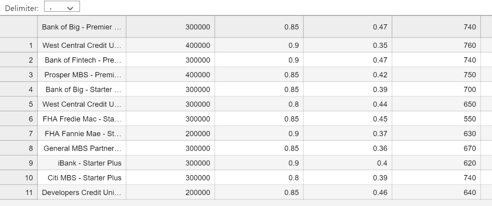
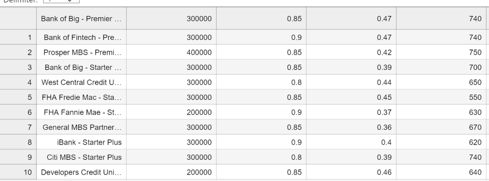

# Module2_Challenge
Module2 Challenge

## QUALIFYING LOANS CSV

The purpose of the project is for the software to prompt the user to save the file to a csv.

### Technologies

Programming Language is Python
Version Control system is Github
Git Bash
IDE is vscode

Libraries are given below
fire
sys
questionary
pathlib
csvsqlite3

### Installation Guide

Install below libraries
fire
sys
questionary
pathlib
csvsqlite3

### Usage

To cater to business requirement to save qualifying loans as csv file.

## Contributors

Kranthi Mitta
Firas Obied
Jennifer Zhang

## License

NA

